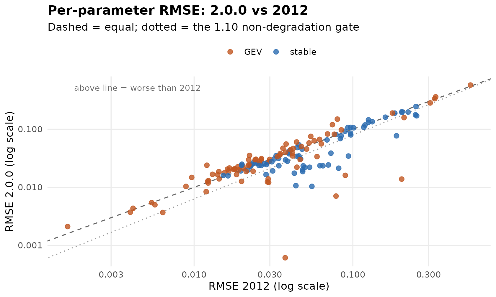
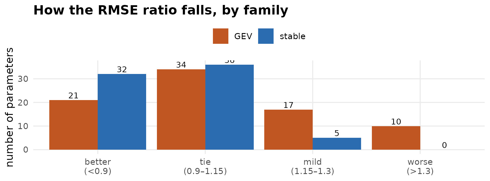
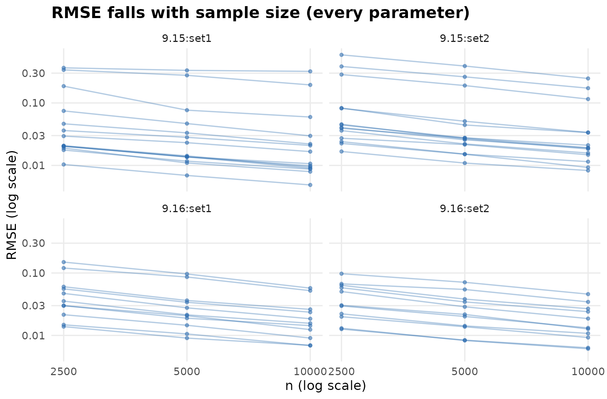
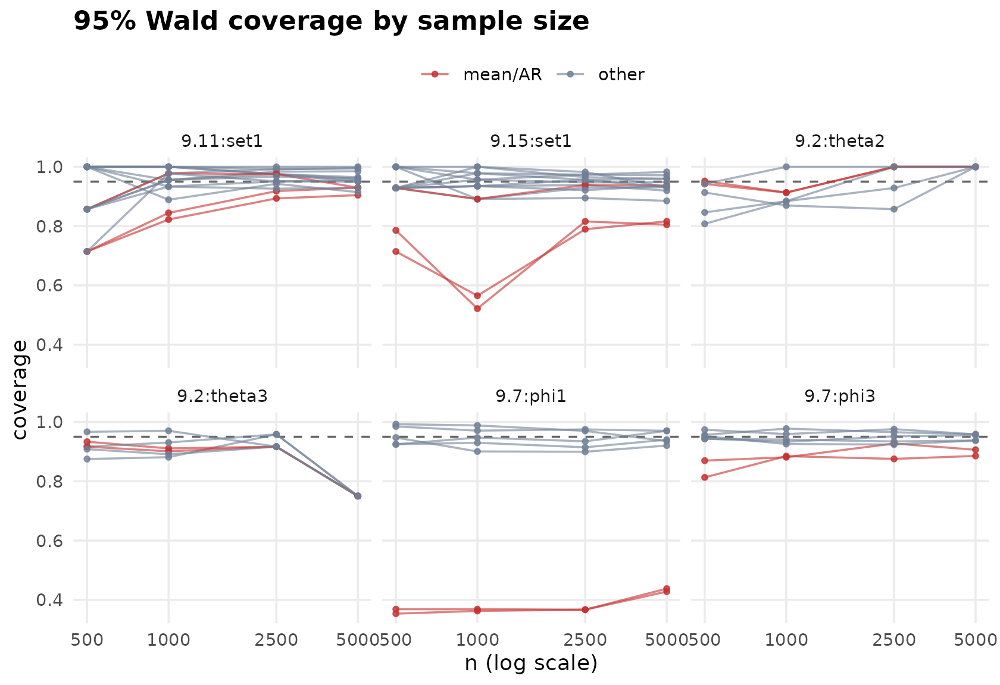
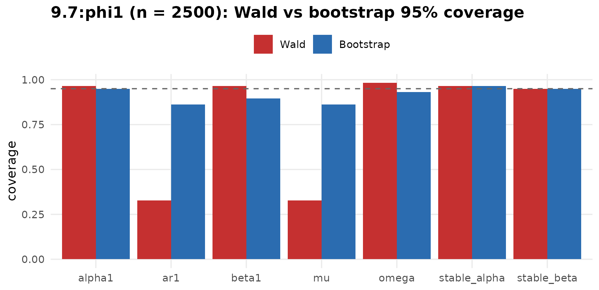

# Monte Carlo simulation study

This study checks that the rewrite (2.0.0) estimates the
ARMA-GARCH/APARCH models with stable and GEV innovations **at least as
accurately as** the 2012 version (do Rego Sousa, master thesis), and
adds the consistency and standard-error calibration evidence the thesis
did not report. The reproducible scripts live in
`dev/benchmarks/arma-garch-mc/`; the figures below are built from
precomputed results (the study takes hours and cannot run during a
package build).

## Part A — non-degradation against the 2012 thesis

Every maximum-likelihood simulation table of the thesis appendix (Tables
9.2, 9.7, 9.11–9.17) is reproduced with 2.0.0: **100 series of length n
= 2500**, the same parameter sets. For each parameter we compare the new
RMSE to the 2012 RMSE. The key picture: plot the two against each other.
A point **on or below the diagonal** is as accurate as, or better than,
2012.

Most points sit on or below the diagonal. Summarised by how the ratio
`rmse_new / rmse_2012` falls (ties are within Monte Carlo error at R =
100):

The stable family (the package’s headline) has **no regressions**; the
GEV family is median-unbiased, with a few higher-variance parameters in
the ARMA(2,2) cells — which the next section shows are a small-sample
effect.

Full per-parameter table (173 rows)

| Cell       | Param        |  True | RMSE 2.0.0 | RMSE 2012 | Ratio | Comparable | Pass  |
|:-----------|:-------------|------:|-----------:|----------:|------:|:-----------|:------|
| 9.11:set1  | alpha1       |  0.10 |     0.0235 |    0.0648 |  0.36 | TRUE       | TRUE  |
| 9.11:set1  | alpha2       |  0.10 |     0.0236 |    0.0620 |  0.38 | TRUE       | TRUE  |
| 9.11:set1  | ar1          |  0.50 |     0.0262 |    0.0246 |  1.07 | TRUE       | TRUE  |
| 9.11:set1  | ar2          |  0.40 |     0.0248 |    0.0231 |  1.07 | TRUE       | TRUE  |
| 9.11:set1  | beta1        |  0.10 |     0.0923 |    0.0893 |  1.03 | TRUE       | TRUE  |
| 9.11:set1  | beta2        |  0.05 |     0.0453 |    0.0479 |  0.95 | TRUE       | TRUE  |
| 9.11:set1  | delta        |  1.30 |     0.1975 |    0.2229 |  0.89 | TRUE       | TRUE  |
| 9.11:set1  | gamma1       |  0.50 |     0.1611 |    0.1602 |  1.01 | TRUE       | TRUE  |
| 9.11:set1  | gamma2       | -0.50 |     0.1893 |    0.1837 |  1.03 | TRUE       | TRUE  |
| 9.11:set1  | ma1          | -0.40 |     0.0264 |    0.0235 |  1.12 | TRUE       | FALSE |
| 9.11:set1  | ma2          |  0.40 |     0.0192 |    0.0197 |  0.98 | TRUE       | TRUE  |
| 9.11:set1  | mu           |  0.10 |     0.0077 |    0.0095 |  0.80 | FALSE      | TRUE  |
| 9.11:set1  | omega        |  0.05 |     0.0220 |    0.0438 |  0.50 | FALSE      | TRUE  |
| 9.11:set1  | stable_alpha |  1.80 |     0.0266 |    0.0289 |  0.92 | TRUE       | TRUE  |
| 9.11:set1  | stable_beta  | -0.70 |     0.1074 |    0.0931 |  1.15 | TRUE       | FALSE |
| 9.12:set1  | alpha1       |  0.05 |     0.0192 |    0.0313 |  0.61 | TRUE       | TRUE  |
| 9.12:set1  | alpha2       |  0.10 |     0.0221 |    0.0534 |  0.41 | TRUE       | TRUE  |
| 9.12:set1  | ar1          |  0.20 |     0.0387 |    0.0727 |  0.53 | TRUE       | TRUE  |
| 9.12:set1  | ar2          | -0.20 |     0.0309 |    0.0469 |  0.66 | TRUE       | TRUE  |
| 9.12:set1  | beta1        |  0.05 |     0.0768 |    0.0844 |  0.91 | TRUE       | TRUE  |
| 9.12:set1  | beta2        |  0.20 |     0.0800 |    0.0970 |  0.82 | TRUE       | TRUE  |
| 9.12:set1  | delta        |  1.10 |     0.1770 |    0.2479 |  0.71 | TRUE       | TRUE  |
| 9.12:set1  | gamma1       |  0.20 |     0.2463 |    0.2498 |  0.99 | TRUE       | TRUE  |
| 9.12:set1  | gamma2       | -0.20 |     0.1346 |    0.1325 |  1.02 | TRUE       | TRUE  |
| 9.12:set1  | ma1          |  0.30 |     0.0345 |    0.0938 |  0.37 | TRUE       | TRUE  |
| 9.12:set1  | ma2          |  0.50 |     0.0166 |    0.0284 |  0.58 | TRUE       | TRUE  |
| 9.12:set1  | mu           |  0.00 |     0.0235 |    0.1749 |  0.13 | FALSE      | TRUE  |
| 9.12:set1  | omega        |  0.20 |     0.0374 |    0.1176 |  0.32 | FALSE      | TRUE  |
| 9.12:set1  | stable_alpha |  1.60 |     0.0281 |    0.0387 |  0.73 | TRUE       | TRUE  |
| 9.12:set1  | stable_beta  |  0.50 |     0.0691 |    0.0834 |  0.83 | TRUE       | TRUE  |
| 9.13:set1  | alpha1       |  0.10 |     0.0186 |    0.0483 |  0.39 | TRUE       | TRUE  |
| 9.13:set1  | alpha2       |  0.10 |     0.0234 |    0.0487 |  0.48 | TRUE       | TRUE  |
| 9.13:set1  | ar1          |  0.20 |     0.0539 |    0.0457 |  1.18 | TRUE       | FALSE |
| 9.13:set1  | ar2          | -0.20 |     0.0397 |    0.0392 |  1.01 | TRUE       | TRUE  |
| 9.13:set1  | beta1        |  0.10 |     0.1317 |    0.1254 |  1.05 | TRUE       | TRUE  |
| 9.13:set1  | beta2        |  0.10 |     0.0856 |    0.0967 |  0.89 | TRUE       | TRUE  |
| 9.13:set1  | ma1          |  0.30 |     0.0483 |    0.0446 |  1.08 | TRUE       | TRUE  |
| 9.13:set1  | ma2          |  0.50 |     0.0237 |    0.0265 |  0.90 | TRUE       | TRUE  |
| 9.13:set1  | mu           |  0.10 |     0.0106 |    0.0455 |  0.23 | FALSE      | TRUE  |
| 9.13:set1  | omega        |  0.10 |     0.0164 |    0.0452 |  0.36 | FALSE      | TRUE  |
| 9.13:set1  | stable_alpha |  1.90 |     0.0230 |    0.0227 |  1.02 | TRUE       | TRUE  |
| 9.13:set1  | stable_beta  |  0.00 |     0.2002 |    0.2038 |  0.98 | TRUE       | TRUE  |
| 9.13:set2  | alpha1       |  0.10 |     0.0175 |    0.0428 |  0.41 | TRUE       | TRUE  |
| 9.13:set2  | alpha2       |  0.10 |     0.0219 |    0.0498 |  0.44 | TRUE       | TRUE  |
| 9.13:set2  | ar1          |  0.20 |     0.0429 |    0.0401 |  1.07 | TRUE       | TRUE  |
| 9.13:set2  | ar2          | -0.20 |     0.0296 |    0.0376 |  0.79 | TRUE       | TRUE  |
| 9.13:set2  | beta1        |  0.10 |     0.1182 |    0.1192 |  0.99 | TRUE       | TRUE  |
| 9.13:set2  | beta2        |  0.10 |     0.0810 |    0.0783 |  1.04 | TRUE       | TRUE  |
| 9.13:set2  | ma1          |  0.30 |     0.0377 |    0.0397 |  0.95 | TRUE       | TRUE  |
| 9.13:set2  | ma2          |  0.50 |     0.0198 |    0.0218 |  0.91 | TRUE       | TRUE  |
| 9.13:set2  | mu           |  0.10 |     0.0109 |    0.0583 |  0.19 | FALSE      | TRUE  |
| 9.13:set2  | omega        |  0.10 |     0.0141 |    0.0442 |  0.32 | FALSE      | TRUE  |
| 9.13:set2  | stable_alpha |  1.70 |     0.0308 |    0.0320 |  0.96 | TRUE       | TRUE  |
| 9.13:set2  | stable_beta  | -0.50 |     0.0771 |    0.1882 |  0.41 | TRUE       | TRUE  |
| 9.14:set1  | alpha1       |  0.10 |     0.0200 |    0.0483 |  0.41 | TRUE       | TRUE  |
| 9.14:set1  | ar1          |  0.20 |     0.0347 |    0.0457 |  0.76 | TRUE       | TRUE  |
| 9.14:set1  | beta1        |  0.10 |     0.1449 |    0.1254 |  1.16 | TRUE       | FALSE |
| 9.14:set1  | ma1          |  0.30 |     0.0342 |    0.0446 |  0.77 | TRUE       | TRUE  |
| 9.14:set1  | mu           |  0.10 |     0.0064 |    0.0455 |  0.14 | FALSE      | TRUE  |
| 9.14:set1  | omega        |  0.10 |     0.0176 |    0.0452 |  0.39 | FALSE      | TRUE  |
| 9.14:set1  | stable_alpha |  1.90 |     0.0236 |    0.0227 |  1.04 | TRUE       | TRUE  |
| 9.14:set1  | stable_beta  |  0.00 |     0.1948 |    0.2038 |  0.96 | TRUE       | TRUE  |
| 9.14:set2  | alpha1       |  0.20 |     0.0213 |    0.0814 |  0.26 | TRUE       | TRUE  |
| 9.14:set2  | ar1          |  0.30 |     0.0316 |    0.0341 |  0.93 | TRUE       | TRUE  |
| 9.14:set2  | beta1        |  0.15 |     0.0655 |    0.0687 |  0.95 | TRUE       | TRUE  |
| 9.14:set2  | ma1          |  0.20 |     0.0351 |    0.0329 |  1.07 | TRUE       | TRUE  |
| 9.14:set2  | mu           |  0.10 |     0.0067 |    0.0204 |  0.33 | FALSE      | TRUE  |
| 9.14:set2  | omega        |  0.10 |     0.0097 |    0.0434 |  0.22 | FALSE      | TRUE  |
| 9.14:set2  | stable_alpha |  1.80 |     0.0256 |    0.0253 |  1.01 | TRUE       | TRUE  |
| 9.14:set2  | stable_beta  |  0.50 |     0.1077 |    0.0969 |  1.11 | TRUE       | FALSE |
| 9.15:set1  | alpha1       |  0.10 |     0.0278 |    0.0297 |  0.94 | TRUE       | TRUE  |
| 9.15:set1  | alpha2       |  0.10 |     0.0337 |    0.0334 |  1.01 | TRUE       | TRUE  |
| 9.15:set1  | ar1          |  0.50 |     0.0209 |    0.0180 |  1.16 | TRUE       | FALSE |
| 9.15:set1  | ar2          |  0.40 |     0.0204 |    0.0177 |  1.15 | TRUE       | FALSE |
| 9.15:set1  | beta1        |  0.10 |     0.0753 |    0.0543 |  1.39 | TRUE       | FALSE |
| 9.15:set1  | beta2        |  0.05 |     0.0466 |    0.0421 |  1.11 | TRUE       | FALSE |
| 9.15:set1  | delta        |  1.30 |     0.1899 |    0.1775 |  1.07 | TRUE       | TRUE  |
| 9.15:set1  | gamma1       |  0.50 |     0.1588 |    0.2101 |  0.76 | TRUE       | TRUE  |
| 9.15:set1  | gamma2       | -0.50 |     0.3358 |    0.3278 |  1.02 | TRUE       | TRUE  |
| 9.15:set1  | ma1          | -0.40 |     0.0205 |    0.0162 |  1.27 | TRUE       | FALSE |
| 9.15:set1  | ma2          |  0.40 |     0.0186 |    0.0143 |  1.30 | TRUE       | FALSE |
| 9.15:set1  | mu           |  0.10 |     0.0104 |    0.0089 |  1.17 | TRUE       | FALSE |
| 9.15:set1  | omega        |  0.05 |     0.0192 |    0.0165 |  1.16 | TRUE       | FALSE |
| 9.15:set1  | xi           |  0.20 |     0.0177 |    0.0155 |  1.14 | TRUE       | FALSE |
| 9.15:set2  | alpha1       |  0.05 |     0.0271 |    0.0258 |  1.05 | TRUE       | TRUE  |
| 9.15:set2  | alpha2       |  0.10 |     0.0382 |    0.0349 |  1.09 | TRUE       | TRUE  |
| 9.15:set2  | ar1          |  0.20 |     0.0444 |    0.0405 |  1.10 | TRUE       | TRUE  |
| 9.15:set2  | ar2          | -0.20 |     0.0360 |    0.0347 |  1.04 | TRUE       | TRUE  |
| 9.15:set2  | beta1        |  0.05 |     0.0829 |    0.0693 |  1.20 | TRUE       | FALSE |
| 9.15:set2  | beta2        |  0.20 |     0.0820 |    0.0765 |  1.07 | TRUE       | TRUE  |
| 9.15:set2  | delta        |  1.50 |     0.2840 |    0.3071 |  0.92 | TRUE       | TRUE  |
| 9.15:set2  | gamma1       |  0.20 |     0.5760 |    0.5504 |  1.05 | TRUE       | TRUE  |
| 9.15:set2  | gamma2       | -0.20 |     0.3613 |    0.3325 |  1.09 | TRUE       | TRUE  |
| 9.15:set2  | ma1          |  0.30 |     0.0403 |    0.0377 |  1.07 | TRUE       | TRUE  |
| 9.15:set2  | ma2          |  0.50 |     0.0225 |    0.0189 |  1.19 | TRUE       | FALSE |
| 9.15:set2  | mu           |  0.00 |     0.0240 |    0.0120 |  1.99 | TRUE       | FALSE |
| 9.15:set2  | omega        |  0.20 |     0.0456 |    0.0511 |  0.89 | TRUE       | TRUE  |
| 9.15:set2  | xi           |  0.10 |     0.0167 |    0.0131 |  1.28 | TRUE       | FALSE |
| 9.16:set1  | alpha1       |  0.05 |     0.0148 |    0.0097 |  1.53 | TRUE       | FALSE |
| 9.16:set1  | alpha2       |  0.10 |     0.0215 |    0.0167 |  1.29 | TRUE       | FALSE |
| 9.16:set1  | ar1          |  0.20 |     0.0602 |    0.0442 |  1.36 | TRUE       | FALSE |
| 9.16:set1  | ar2          | -0.20 |     0.0471 |    0.0363 |  1.30 | TRUE       | FALSE |
| 9.16:set1  | beta1        |  0.05 |     0.1494 |    0.0799 |  1.87 | TRUE       | FALSE |
| 9.16:set1  | beta2        |  0.20 |     0.1200 |    0.0743 |  1.61 | TRUE       | FALSE |
| 9.16:set1  | ma1          |  0.30 |     0.0556 |    0.0380 |  1.46 | TRUE       | FALSE |
| 9.16:set1  | ma2          |  0.50 |     0.0299 |    0.0220 |  1.35 | TRUE       | FALSE |
| 9.16:set1  | mu           |  0.10 |     0.0300 |    0.0466 |  0.65 | TRUE       | TRUE  |
| 9.16:set1  | omega        |  0.20 |     0.0354 |    0.0223 |  1.59 | TRUE       | FALSE |
| 9.16:set1  | xi           | -0.10 |     0.0138 |    0.2030 |  0.07 | TRUE       | TRUE  |
| 9.16:set2  | alpha1       |  0.10 |     0.0199 |    0.0191 |  1.04 | TRUE       | TRUE  |
| 9.16:set2  | alpha2       |  0.20 |     0.0296 |    0.0264 |  1.12 | TRUE       | FALSE |
| 9.16:set2  | ar1          |  0.20 |     0.0635 |    0.0571 |  1.11 | TRUE       | FALSE |
| 9.16:set2  | ar2          | -0.20 |     0.0504 |    0.0474 |  1.06 | TRUE       | TRUE  |
| 9.16:set2  | beta1        |  0.10 |     0.0974 |    0.0846 |  1.15 | TRUE       | FALSE |
| 9.16:set2  | beta2        |  0.10 |     0.0670 |    0.0617 |  1.09 | TRUE       | TRUE  |
| 9.16:set2  | ma1          |  0.30 |     0.0580 |    0.0530 |  1.10 | TRUE       | TRUE  |
| 9.16:set2  | ma2          |  0.50 |     0.0304 |    0.0245 |  1.24 | TRUE       | FALSE |
| 9.16:set2  | mu           |  0.10 |     0.0222 |    0.0444 |  0.50 | TRUE       | TRUE  |
| 9.16:set2  | omega        |  0.10 |     0.0130 |    0.0123 |  1.06 | TRUE       | TRUE  |
| 9.16:set2  | xi           | -0.20 |     0.0126 |    0.0122 |  1.04 | TRUE       | TRUE  |
| 9.17:set1  | alpha1       |  0.20 |     0.0213 |    0.0204 |  1.04 | TRUE       | TRUE  |
| 9.17:set1  | ar1          |  0.30 |     0.0245 |    0.0221 |  1.11 | TRUE       | FALSE |
| 9.17:set1  | beta1        |  0.20 |     0.0347 |    0.0417 |  0.83 | TRUE       | TRUE  |
| 9.17:set1  | ma1          |  0.40 |     0.0240 |    0.0201 |  1.19 | TRUE       | FALSE |
| 9.17:set1  | mu           |  0.10 |     0.0121 |    0.0295 |  0.41 | TRUE       | TRUE  |
| 9.17:set1  | omega        |  0.05 |     0.0037 |    0.0040 |  0.94 | TRUE       | TRUE  |
| 9.17:set1  | xi           |  0.10 |     0.0165 |    0.0141 |  1.18 | TRUE       | FALSE |
| 9.17:set2  | alpha1       |  0.20 |     0.0237 |    0.0219 |  1.08 | TRUE       | TRUE  |
| 9.17:set2  | ar1          |  0.30 |     0.0312 |    0.0266 |  1.17 | TRUE       | FALSE |
| 9.17:set2  | beta1        |  0.20 |     0.0560 |    0.0633 |  0.89 | TRUE       | TRUE  |
| 9.17:set2  | ma1          |  0.40 |     0.0299 |    0.0242 |  1.23 | TRUE       | FALSE |
| 9.17:set2  | mu           |  0.10 |     0.0124 |    0.0290 |  0.43 | TRUE       | TRUE  |
| 9.17:set2  | omega        |  0.05 |     0.0050 |    0.0057 |  0.88 | TRUE       | TRUE  |
| 9.17:set2  | xi           | -0.10 |     0.0140 |    0.0144 |  0.97 | TRUE       | TRUE  |
| 9.2:theta1 | alpha1       |  0.45 |     0.0338 |    0.0595 |  0.57 | TRUE       | TRUE  |
| 9.2:theta1 | ar1          |  0.32 |     0.0161 |    0.0896 |  0.18 | TRUE       | TRUE  |
| 9.2:theta1 | beta1        |  0.08 |     0.0206 |    0.0181 |  1.14 | TRUE       | FALSE |
| 9.2:theta1 | mu           |  0.21 |     0.0071 |    0.0783 |  0.09 | TRUE       | TRUE  |
| 9.2:theta1 | omega        |  0.01 |     0.0006 |    0.0375 |  0.02 | TRUE       | TRUE  |
| 9.2:theta1 | xi           |  0.08 |     0.0166 |    0.0185 |  0.90 | TRUE       | TRUE  |
| 9.2:theta2 | alpha1       |  0.80 |     0.0386 |    0.0417 |  0.93 | TRUE       | TRUE  |
| 9.2:theta2 | ar1          |  0.10 |     0.0127 |    0.0199 |  0.64 | TRUE       | TRUE  |
| 9.2:theta2 | beta1        |  0.02 |     0.0055 |    0.0054 |  1.01 | TRUE       | TRUE  |
| 9.2:theta2 | mu           |  0.01 |     0.0044 |    0.0041 |  1.05 | TRUE       | TRUE  |
| 9.2:theta2 | omega        |  0.01 |     0.0021 |    0.0016 |  1.32 | TRUE       | FALSE |
| 9.2:theta2 | xi           |  0.20 |     0.0189 |    0.0235 |  0.80 | TRUE       | TRUE  |
| 9.2:theta3 | alpha1       |  0.50 |     0.0302 |    0.0299 |  1.01 | TRUE       | TRUE  |
| 9.2:theta3 | ar1          |  0.20 |     0.0139 |    0.0293 |  0.48 | TRUE       | TRUE  |
| 9.2:theta3 | beta1        |  0.10 |     0.0118 |    0.0123 |  0.97 | TRUE       | TRUE  |
| 9.2:theta3 | mu           |  0.05 |     0.0084 |    0.0119 |  0.71 | TRUE       | TRUE  |
| 9.2:theta3 | omega        |  0.05 |     0.0037 |    0.0063 |  0.58 | TRUE       | TRUE  |
| 9.2:theta3 | xi           |  0.30 |     0.0187 |    0.0213 |  0.88 | TRUE       | TRUE  |
| 9.7:phi1   | alpha1       |  0.45 |     0.0239 |    0.0199 |  1.20 | TRUE       | FALSE |
| 9.7:phi1   | ar1          |  0.32 |     0.0158 |    0.0164 |  0.96 | TRUE       | TRUE  |
| 9.7:phi1   | beta1        |  0.08 |     0.0275 |    0.0309 |  0.89 | TRUE       | TRUE  |
| 9.7:phi1   | mu           |  0.21 |     0.0049 |    0.0051 |  0.96 | FALSE      | TRUE  |
| 9.7:phi1   | omega        |  0.01 |     0.0006 |    0.0007 |  0.80 | FALSE      | TRUE  |
| 9.7:phi1   | stable_alpha |  1.80 |     0.0246 |    0.0285 |  0.86 | TRUE       | TRUE  |
| 9.7:phi1   | stable_beta  |  0.50 |     0.1079 |    0.1173 |  0.92 | TRUE       | TRUE  |
| 9.7:phi2   | alpha1       |  0.80 |     0.0243 |    0.0701 |  0.35 | TRUE       | TRUE  |
| 9.7:phi2   | ar1          |  0.10 |     0.0104 |    0.0552 |  0.19 | TRUE       | TRUE  |
| 9.7:phi2   | beta1        |  0.02 |     0.0107 |    0.0438 |  0.24 | TRUE       | TRUE  |
| 9.7:phi2   | mu           |  0.01 |     0.0005 |    0.0008 |  0.66 | FALSE      | TRUE  |
| 9.7:phi2   | omega        |  0.01 |     0.0006 |    0.0009 |  0.64 | FALSE      | TRUE  |
| 9.7:phi2   | stable_alpha |  1.90 |     0.0235 |    0.0342 |  0.69 | TRUE       | TRUE  |
| 9.7:phi2   | stable_beta  |  0.50 |     0.1705 |    0.2522 |  0.68 | TRUE       | TRUE  |
| 9.7:phi3   | alpha1       |  0.50 |     0.0250 |    0.0200 |  1.25 | TRUE       | FALSE |
| 9.7:phi3   | ar1          |  0.20 |     0.0160 |    0.0153 |  1.05 | TRUE       | TRUE  |
| 9.7:phi3   | beta1        |  0.10 |     0.0238 |    0.0256 |  0.93 | TRUE       | TRUE  |
| 9.7:phi3   | mu           |  0.05 |     0.0028 |    0.0030 |  0.93 | FALSE      | TRUE  |
| 9.7:phi3   | omega        |  0.05 |     0.0030 |    0.0035 |  0.86 | FALSE      | TRUE  |
| 9.7:phi3   | stable_alpha |  1.80 |     0.0254 |    0.0277 |  0.92 | TRUE       | TRUE  |
| 9.7:phi3   | stable_beta  |  0.50 |     0.1058 |    0.1011 |  1.05 | TRUE       | TRUE  |

## Consistency

For the GEV ARMA(2,2) cells (where Part A showed the only higher
variance), RMSE is tracked across sample sizes n = 2500, 5000, 10000 (R
= 100). Every parameter (one line) declines with n — the empirical face
of consistency.

## Part B — standard-error calibration (Wald coverage)

On a representative subset (two AR(1)-GARCH per family and one APARCH
each), fits at n = 500, 1000, 2500, 5000 (R = 300) record the 95% Wald
coverage. The shaded band is a reasonable \[0.90, 0.98\] window around
the 0.95 target. Mean-equation parameters (`mu`, `ar1`, `ar2`) are
highlighted.

Coverage is near nominal for the well-identified parameters. Two
limitations stand out, both expected:

- **Stable mean/AR parameters undercover with Wald** — in `9.7:phi1` the
  coverage of `mu` and `ar1` is ~0.35–0.44 at every n, because under
  infinite-variance stable innovations these estimators have a
  non-Gaussian limit, so symmetric Wald intervals are invalid. The
  parametric bootstrap of
  [`gs_bootstrap()`](https://thiagodoregosousa.github.io/GEVStableGarch/reference/gs_bootstrap.md)
  restores calibration (next section).
- **Near-non-stationary GEV cells** (`9.2:theta2`, `theta3`) have mostly
  unavailable Hessian standard errors: their persistence exceeds one
  under the scale-1 GEV standardization (infinite unconditional
  variance), for which Hessian SEs are meaningless. Point estimates stay
  consistent. (Flagged in `TODO.md` for investigation.)

## Bootstrap vs Wald for stable mean/AR parameters

For `9.7:phi1` at n = 2500, the 95% parametric-bootstrap coverage next
to the Wald coverage (R = 80 replications, B = 99 resamples). The
bootstrap lifts the `mu`/`ar1` coverage back toward 0.95.

## Reference

do Rego Sousa, T. (2012). *Modelos combinados AR-GARCH*. Master thesis,
Universidade de Brasília. Appendix, Chapter 9 (MLE Tables 9.2, 9.7,
9.11–9.17).
